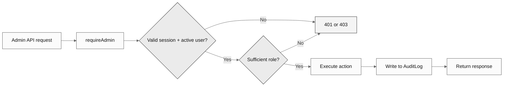

# **Admin System**

  
<strong>Table of Contents</strong>

- [Roles](#roles)
- [How Admin Access Works](#how-admin-access-works)
- [Audit Logging](#audit-logging)
- [User Actions](#user-actions)
- [System Health](#system-health)
- [Announcements](#announcements)

The admin panel provides user management, audit logging, system monitoring, and announcements. Access is restricted by role.

## Roles

| Role         | Capabilities                                                                             |
| :----------- | :--------------------------------------------------------------------------------------- |
| `admin`      | View users, suspend/unsuspend accounts, reset 2FA, manage announcements, view audit logs |
| `superadmin` | Everything above, plus: delete users, change roles, promote to admin/superadmin          |

Every admin API route calls `requireAdmin()`, which is the admin equivalent of `getAuthUserId()`. Here is what it does step by step:

1. Read the `auth-token` cookie and verify the HMAC signature (same as `getAuthUserId()`).
2. Look up the user in the database and confirm their status is `"active"`.
3. Check that the user's `role` is in the allowed list (`["admin", "superadmin"]`). If not, return a 403 Forbidden error.
4. For operations that require superadmin (like deleting users or changing roles), an additional check verifies `role === "superadmin"`.
5. If all checks pass, return the admin user object so the route handler can proceed.

As a safety measure, admins cannot perform actions on themselves — they cannot suspend, delete, or change their own role. This prevents accidental self-lockout and limits the damage from a compromised admin account.

## How Admin Access Works

## Audit Logging

An audit log is a tamper-evident record of every sensitive action performed in the system. It answers the questions: **who** did **what** to **whom**, **when**, and **from where**.

Every admin action creates a row in the `AuditLog` table with the following fields:

- **`performerId`** — The ID of the admin who performed the action.
- **`targetUserId`** — The ID of the user the action was performed on.
- **`action`** — A machine-readable label describing the action (e.g., `user.suspend`, `user.delete`, `user.role_change`, `user.reset_2fa`).
- **`entity`** — The type of entity affected (e.g., `"User"`).
- **`entityId`** — The database ID of the affected entity.
- **`details`** — An optional JSON object with additional context (e.g., `{"reason": "Suspicious activity"}` for suspensions, or `{"from": "user", "to": "admin"}` for role changes).
- **`ipAddress`** — The IP address of the admin at the time of the action. Captured from the request headers.
- **`createdAt`** — Automatic timestamp.

The table is indexed by `performerId`, `targetUserId`, `action`, and `createdAt` for fast filtering and investigation. For example, an admin can quickly answer `what actions did admin X take last week?` or `show me all suspensions for user Y.`

Audit logs are immutable — they are created, never updated or deleted. This ensures a reliable history even if an admin account is later compromised.

## User Actions

| Action      | Effect                                               | Who Can Do It     |
| :---------- | :--------------------------------------------------- | :---------------- |
| Suspend     | User can't log in, data preserved, requires a reason | Admin, Superadmin |
| Unsuspend   | Restores access                                      | Admin, Superadmin |
| Ban         | Stronger signal than suspend, data preserved         | Admin, Superadmin |
| Delete      | Removes user and all related data (cascading)        | Superadmin only   |
| Change role | Promote or demote between user/admin/superadmin      | Superadmin only   |
| Reset 2FA   | Disables 2FA on the user's account                   | Admin, Superadmin |

## System Health

The health endpoint (`GET /api/admin/health`) provides a real-time snapshot of the system's status. It is designed for admins to quickly assess whether everything is operating normally.

The response includes:

- **Database latency** — A simple query is timed to measure how long the database takes to respond (in milliseconds). A sudden spike indicates database performance issues.
- **Table row counts** — The number of rows in major tables (Users, Transactions, BankAccounts, etc.). Useful for understanding system scale and spotting anomalies (e.g., a sudden drop in rows could indicate accidental deletion).
- **Security metrics** — Aggregated statistics like the percentage of users with 2FA enabled, number of suspended/banned accounts, and number of active sessions.
- **Activity trends** — Recent registration counts, login frequency, and transaction volume over time.
- **Runtime information** — Node.js version, process uptime, and memory usage (heap used vs. total). Helps diagnose memory leaks or determine if the server needs to be restarted.

## Announcements

Announcements are system-wide messages displayed to all users. They are useful for communicating maintenance windows, new features, security advisories, or service disruptions.

Each announcement has:
- **`title`** and **`content`** — The message to display.
- **`type`** — One of `info`, `warning`, `critical`, or `maintenance`. The type determines the visual styling (color, icon) shown to users.
- **`startsAt`** and **`expiresAt`** — Optional visibility window. If set, the announcement only appears between these timestamps. After `expiresAt`, it is automatically hidden without needing manual removal.
- **`isActive`** — A manual toggle to show or hide the announcement regardless of the time window.

Announcements are stored in the `SystemAnnouncement` table and are not tied to any specific user — they are global.

---

**Previous file:** [← Financial Features](Financial%20Features.md)

**Next file:** [API Reference](API%20Reference.md) →
