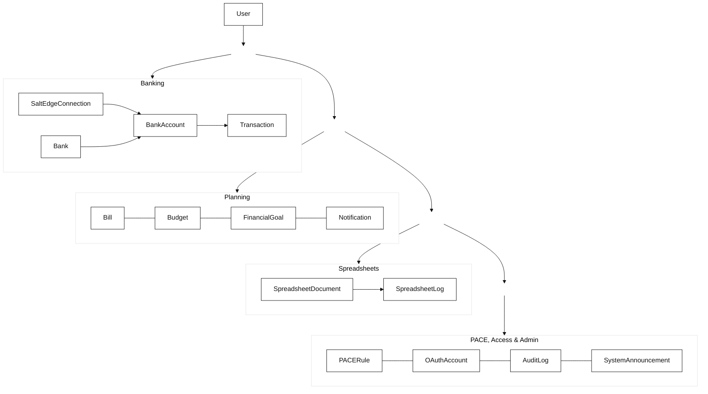

# **Database Schema**
Last update: 14.04.2026

 

  
<strong>Table of Contents</strong>

#

- [Overview](#overview)
- [Schema at a Glance](#schema-at-a-glance)
  - [Relationship Overview](#relationship-overview)
  - [Core Table Summary](#core-table-summary)
- [Deletion Behavior](#deletion-behavior)
  - [Hard Delete](#hard-delete)
  - [Soft Delete](#soft-delete)
- [Model Groups](#model-groups)
  - [User](#user)
  - [Banking Models](#banking-models)
  - [Finance Models](#finance-models)
  - [PACE Rules](#pace-rules)
  - [Spreadsheet Models](#spreadsheet-models)
  - [Admin Models](#admin-models)
- [Field Notes](#field-notes)
- [Schema Conventions](#schema-conventions)

#

 

## Overview

Argent's database is organized around a single authenticated `User`. From that root, the schema branches into banking data, personal finance planning, PACE categorization, spreadsheets, and admin/audit features.

Financial records are user-owned and filtered through `userId` on application queries. Cascade deletion applies through the user.

The source of truth is `prisma/schema.prisma`, while the structure below highlights the relationships and responsibilities that shape the app's data layer.

 

## Schema

### Relationship Overview

 

### Core Tables

| Model                                             | Purpose                                | Key relations                                                                  |
| :------------------------------------------------ | :------------------------------------- | :----------------------------------------------------------------------------- |
| `User`                                            | Root identity and security record      | Owns almost all user-scoped data and connects to admin/audit flows.                        |
| `SaltEdgeConnection`                              | Open Banking connection state          | Belongs to a user. Groups imported bank accounts from Salt Edge.                           |
| `BankAccount`                                     | Local account cache                    | Belongs to a user, may belong to a Salt Edge connection.                                   |
| `Transaction`                                     | Imported or created financial activity | Belongs to a user. Stores amount, date, description, and tags.                             |
| `Bill`, `Budget`, `FinancialGoal`, `Notification` | Planning and tracking layer            | All are user-owned and cascade-delete with the user.                                      |
| `PACERule`                                        | Custom categorization logic            | Belongs to a user. Defines how transactions are auto-tagged.                              |
| `SpreadsheetDocument`                             | Workbook storage                       | Belongs to a user. Stores sheet content as JSON.                                          |
| `SpreadsheetLog`                                  | Change history                         | Tracks spreadsheet actions (cell edits, renames, sheet operations) with timestamps.        |
| `AuditLog`                                        | Administrative traceability            | Links an admin performer to an action and optionally to a target user.                     |
| `SystemAnnouncement`                              | Platform-wide notices                  | Standalone admin-created messages shown across the app.                                    |

 

## Deletion Behavior

Argent currently uses both **hard delete** and **soft delete**, depending on the flow.

### Hard Delete

When a user deletes their own account through the normal account settings flow, the app calls `prisma.user.delete()`. Because most user-owned relations use `onDelete: Cascade`, that physical deletion also removes related records such as:

- `BankAccount`
- `Transaction`
- `Bill`
- `Budget`
- `FinancialGoal`
- `Notification`
- `PACERule`
- `OAuthAccount`
- `SaltEdgeConnection`
- `SpreadsheetDocument`
- `SpreadsheetLog`

### Soft Delete

The admin-side **delete** action is currently a soft delete. Instead of removing the user row, the admin route updates the account to `status = "deleted"`. Normal admins can perform this soft delete for non-superadmin users; admins cannot delete themselves, and non-superadmin admins cannot modify or delete superadmin accounts. Role changes remain `superadmin` only.

That means the account is disabled and rejected by `getAuthUserId()` because only `status = "active"` is allowed, but the row itself still exists for admin review and status tracking.

> This is why `User.status` still includes `"deleted"` even though cascade delete is also used elsewhere.

 

## Model Groups

### User

The `User` model stores identity, authentication, security, and admin lifecycle information.

| Field                                                     | Purpose                                                                                         |
| :-------------------------------------------------------- | :---------------------------------------------------------------------------------------------- |
| `role`                                                    | Permission level: `"user"`, `"admin"`, or `"superadmin"`.                                       |
| `status`                                                  | Lifecycle state: `"active"`, `"suspended"`, `"banned"`, or `"deleted"`.                         |
| `password`                                                | Stores the scrypt-formatted password hash. OAuth-only users may not rely on a local password flow. |
| `suspendedAt` / `suspendedReason`                         | Administrative context for moderation actions.                                                  |

### Banking Models

`SaltEdgeConnection`, `BankAccount`, and `Transaction` represent the Open Banking side of the app.

| Model                | Important fields                                       | Notes                                                                                                          |
| :------------------- | :----------------------------------------------------- | :------------------------------------------------------------------------------------------------------------- |
| `SaltEdgeConnection` | `connectionId`, `providerCode`, `status`, `lastSyncAt` | Tracks the external Salt Edge connection and sync state.                                                       |
| `BankAccount`        | `saltEdgeAccountId`, `balance`, `currency`, `isActive` | Stores the local cached representation of an imported or linked account.                                       |
| `Transaction`        | `saltEdgeId`, `tags`, `amount`, `description`          | `saltEdgeId` prevents duplicate imports, while `tags` stores multiple categories as a PostgreSQL string array. |

### Finance Models

The planning layer is built from `Bill`, `Budget`, `FinancialGoal`, and `Notification`.

- `Bill` handles recurring payments and due-state tracking.
- `Budget` stores a per-category spending limit.
- `FinancialGoal` tracks savings progress, target amount, and status.
- `Notification` stores in-app alerts and optional deep links.

All of these are user-owned and cascade-delete with the user.

### PACE Rules

`PACERule` stores the user's custom transaction-tagging logic.

Key fields:
- `pattern` — keyword or regex expression
- `matchField` — currently defaults to `description`
- `tag` — the category to apply on match
- `priority` — higher values should be checked first

### Admin Models

The admin system uses `AuditLog` and `SystemAnnouncement`.

- `AuditLog` records actions such as suspending users, deleting users, or changing roles.
- `SystemAnnouncement` stores admin-created notices shown to users.

A notable detail in `AuditLog` is that `targetUserId` uses `onDelete: SetNull`, so a log can still exist even if the affected user is removed. The `performerId` relation still points to the admin who performed the action.

### Spreadsheet Models

`SpreadsheetDocument` and `SpreadsheetLog` store workbook data and change history.

| Model                  | Important fields                                              | Notes                                                                                                                          |
| :--------------------- | :------------------------------------------------------------ | :----------------------------------------------------------------------------------------------------------------------------- |
| `SpreadsheetDocument`  | `name`, `content` (JSON), `sheetType`, `linkedEntity`         | Stores workbook data as JSON. Type can be `"manual"` or `"linked"`. Linked entity can be `transactions`, `budgets`, etc.        |
| `SpreadsheetLog`       | `action`, `summary`, `spreadsheetId`, `userId`                | Tracks changes: `"created"`, `"renamed"`, `"cell_edit"`, `"sheet_added"`, `"sheet_deleted"`, `"content_update"`, etc.           |

Both cascade-delete with their parent `SpreadsheetDocument` and with the user.

 

## Field Notes

**notable fields**

| Field                           | Why it matters                                                                                                        |
| :------------------------------ | :-------------------------------------------------------------------------------------------------------------------- |
| `User.status`                   | Explains whether the account is usable. It also distinguishes soft-deleted admin actions from true database deletion. |
| `User.role`                     | Drives permission checks for `requireAdmin()` and separates normal users from administrators.                         |
| `Transaction.tags`              | Allows one transaction to hold multiple categories at once, which is useful for PACE and manual tagging.              |
| `Transaction.saltEdgeId`        | Acts as the deduplication key for imported banking data.                                                              |
| `BankAccount.saltEdgeAccountId` | Keeps the local account record linked to the provider-side account identity.                                          |
| `PACERule.priority`             | Defines intended rule precedence when multiple categorization rules could match.                                      |

 

## Schema Conventions

- IDs use `cuid()` instead of numeric autoincrement IDs.
- Most money values use `Decimal(20, 2)` for safer currency storage.
- User-owned data generally points back to `User` with `onDelete: Cascade`.
- External provider IDs such as `connectionId` and `saltEdgeId` are marked `@unique` where deduplication matters.
- Role and status values are stored as strings rather than database enums.

---

migrate:

pnpm prisma migrate dev
pnpm prisma generate
pnpm prisma migrate status
pnpm prisma migrate diff --from-config-datasource --to-schema prisma/schema.prisma --exit-code
pnpm run typecheck

---

**Previous file:** [← Technical Documentation](Technical%20Documentation.md)

**Next file:** [Authentication & Security](Authentication%20%26%20Security.md) →
