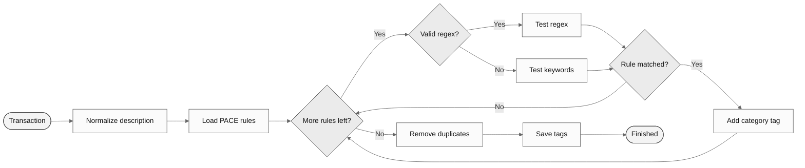

# **PACE — Pattern-Aware Categorization**

  
<strong>Table of Contents</strong>

- [How It Works](#how-it-works)
- [When PACE Runs](#when-pace-runs)
- [PACE Diagram](#pace-diagram)
- [Example Rules](#example-rules)
- [Current Limitations](#current-limitations)

 

PACE is the rule system that automatically tags transactions with categories. Users define rules (a pattern and a tag), and the system evaluates each rule against the transaction description. Rules are managed in Settings → PACE Rules.

## How It Works

Each rule has a `pattern` (a string) and a `tag` (the category to assign if matched). The system processes every rule against the transaction text:

1. **Try regex first** — The pattern is passed to `new RegExp()`. If it compiles successfully, the system runs a case-insensitive regex test against the transaction description.
2. **Fall back to keywords** — If the pattern is not valid regex, the system splits it by `|` and checks if any of the resulting keywords appear in the description (case-insensitive `includes` check).
3. **Accumulate tags** — If the rule matches, its tag is appended to the list. Multiple rules can match the same transaction.
4. **Deduplicate** — After all rules are evaluated, duplicate tags are removed using `new Set()`.

This means users can write patterns at any complexity level:
- Simple: `lidl` — matches any transaction mentioning `lidl`.
- Multi-keyword: `continente|pingo doce|lidl` — matches any of those merchant names (works both as regex alternation and as keyword fallback).
- Advanced regex: `mbway\s+joao` — matches `mbway` followed by whitespace and `joao`.

 

## When PACE Runs

PACE runs when a transaction is **created** via `POST /api/transactions`:
- If the request includes `usePACE: true`, PACE is always run.
- If no tags are provided in the request, PACE runs automatically.
- The user's custom rules are loaded from the database (ordered by `priority` descending), merged with any default rules, and evaluated.
- If PACE finds matches, those tags are used. If PACE finds nothing and no tags were provided, the transaction gets a fallback `"other"` tag.

PACE does **not** retroactively re-tag existing transactions when rules are changed.

 

## PACE Diagram

 

## Example Rules

| Pattern                          | Tag                 | What it matches                      |
| :------------------------------- | :------------------ | :----------------------------------- |
| `continente\\|pingo doce\\|lidl` | `groceries`         | Portuguese supermarket names         |
| `uber eats\\|glovo\\|bolt food`  | `food_delivery`     | Food delivery services               |
| `spotify\\|netflix\\|disney`     | `subscriptions`     | Streaming subscriptions              |
| `mbway\s+joao`                   | `transfer_personal` | MBWay transfers to a specific person |

 

## Current Limitations

- The `matchField` column exists in the schema (allowing matching against fields other than `description`) but is not currently used — all matching runs against the transaction description only.
- The `priority` column exists and rules are loaded ordered by priority, but the system does not stop at the first match — all rules are evaluated regardless.
- There is no confidence scoring, fuzzy matching, or learning from manual corrections.

> [!NOTE]
> A detailed design for confidence-based matching with heuristic scoring is documented in [the dedicated PACE design notes](PACE%20Engine.md).

---

**Previous file:** [← Bank Synchronization](Bank%20Synchronization.md)

**Next file:** [Financial Features](Financial%20Features.md) →
