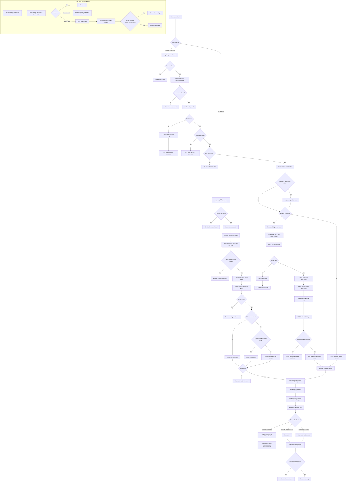

# Login Flow Report

Date: 2026-06-09

## Scope

This report describes the current login flow in Argent from the browser form to session validation on later requests. It covers password login, optional email two-factor verification, OAuth sign-in, route protection, cookies, and operational risks.

The analysis is based on the current worktree, especially:

- `app/(auth)/login/page.tsx`
- `app/api/auth/[action]/route.ts`
- `app/api/auth/oauth/[provider]/route.ts`
- `app/api/auth/oauth/[provider]/callback/route.ts`
- `lib/session.ts`
- `lib/auth-helpers.ts`
- `lib/admin-auth.ts`
- `proxy.ts`
- `app/(main)/layout.tsx`
- `app/(admin)/layout.tsx`

## Executive Summary

Argent uses a custom authentication system, not NextAuth. The server issues a stateless HMAC-signed session token and stores it in the `auth-token` HttpOnly cookie. The database does not store sessions; it stores user status and `sessionVersion`, which are checked against the token on protected pages and APIs.

The password login flow has three main outcomes:

- Invalid credentials or inactive account: no session is created.
- Valid password without email 2FA: a session cookie is issued immediately.
- Valid password with email 2FA: a temporary challenge is created; the session cookie is issued only after the code is verified.

Admins and normal users share the same login endpoint. The client chooses the post-login redirect based on the returned role and a sanitized `callbackUrl`. Server layouts still enforce access, so client redirect logic is not the authorization boundary.

## Main Password Login Flow

1. The user opens `/login` and submits email and password from `LoginPage`.
2. `LoginPage` posts to `POST /api/auth/login` with credentials and `credentials: include`.
3. The auth API checks a per-IP login limiter.
4. The API validates the email and password payload.
5. The API checks a second per-account limiter keyed by normalized email.
6. The API looks up the user by email case-insensitively.
7. If no user exists, the API still runs a dummy password verification before returning the same generic error. This reduces timing-based email enumeration.
8. If a user exists, the server verifies the submitted password against the stored scrypt hash.
9. The user must have `status === "active"`.
10. If the hash uses an old active pepper version, the server prepares a transparent rehash.
11. If email 2FA is disabled, the server persists the rehash if needed, resets the IP limiter, and finishes the authenticated session.
12. The response returns `success`, `userId`, and `role`.
13. The client redirects:
    - admin or superadmin: `/admin` unless the callback is already an admin path.
    - normal user with admin callback: `/`.
    - normal user with normal callback: callback path or `/`.

## Email Two-Factor Flow

Email 2FA is optional and controlled by `User.emailTwoFactorEnabled`.

When it is enabled:

1. After password verification succeeds, the server generates a six-digit code.
2. The server stores only an HMAC of that code in `User.emailTwoFactorCode`.
3. The server stores the expiry in `User.emailTwoFactorCodeExpiry`.
4. The server sends the plaintext code by email through Resend.
5. The server creates an in-memory `tempToken` challenge in `pendingEmailTwoFactor`.
6. The login response returns `needs_2fa: true` and `tempToken`, but no session cookie.
7. The UI switches to the verification-code form.
8. The UI posts `{ tempToken, code }` to `POST /api/auth/2fa-login`.
9. The server checks the temp token, expiry, user status, stored code hash, and attempt count.
10. On success, the server deletes the pending challenge, clears the stored code, and issues the real session cookie.

The resend endpoint, `POST /api/auth/2fa-resend`, creates a new code for the same `tempToken`, resets attempts, and sends another email. It is separately rate-limited by client IP plus temp token.

## Session Model

Sessions are stateless and signed in `lib/session.ts`.

The token format is:

```text
v1.<base64url payload>.<base64url signature>
```

The payload contains:

- `uid`: user id.
- `iat`: issued-at timestamp.
- `exp`: expiry timestamp.
- `sv`: user session version.
- `v`: payload version.

The signature is an HMAC-SHA256 over the payload. `verifySessionToken()` rejects malformed tokens, invalid signatures, expired tokens, and unsupported payload versions.

The API stores the token in:

```text
auth-token
```

Cookie properties:

- `HttpOnly`
- `sameSite: lax`
- `secure` only in production
- `path: /`
- `maxAge: 7 days`

The old `user-session` cookie is explicitly deleted when a new session is issued.

## Route Protection

There are several protection layers:

1. `proxy.ts` runs before page requests. It checks the `auth-token` cookie and verifies the token signature and expiry.
2. Public routes such as `/login`, `/register`, `/forgot-password`, `/reset-password`, `/docs`, and `/logo-demo` are allowed through.
3. Non-public page requests without a valid session are redirected to `/login`; stale cookies are cleared.
4. The main app layout calls `getAuthContext()`. This verifies the token, loads the user, checks `status === "active"`, and checks `sessionVersion`.
5. The main app also requires the user to have at least one imported bank account. Otherwise it redirects to `/connect-bank`.
6. The admin layout repeats token verification and additionally requires role `admin` or `superadmin`.
7. API routes are not protected by `proxy.ts`; they protect themselves by calling `getAuthContext()`, `getAuthUserId()`, or `requireAdmin()`.

Important behavior: the current `proxy.ts` allows public routes immediately. That means an already-authenticated user can still open `/login`; the earlier documentation statement that authenticated users are redirected away from `/login` does not match the current code.

## OAuth Login

OAuth is implemented separately from password login but ends in the same session model.

1. `OAuthButtons` sends the browser to `/api/auth/oauth/google` or `/api/auth/oauth/github`.
2. The provider route validates the provider, reads the provider client id, generates a CSRF `state`, stores it in an HttpOnly cookie, and redirects to the provider authorization URL.
3. The callback route verifies the `state`, exchanges the code for an access token, and fetches user profile data.
4. The callback requires a verified email from the provider.
5. If the OAuth account already exists, it uses the linked user.
6. If no OAuth account exists, it links to an existing verified Argent user by email or creates a new user with a random password.
7. The user must be active.
8. The callback updates login timestamps, creates the same HMAC session token, sets `auth-token`, deletes `user-session`, and redirects to `/`.

OAuth currently does not preserve `callbackUrl`; it always redirects to `/` after successful callback.

## Mermaid Diagram



The same diagram is also saved as `docs/reports/login-flow.mmd`.

## Security Strengths

- Passwords use scrypt with per-password salt and versioned server-side pepper.
- Wrong email and wrong password return the same generic error.
- Missing users still trigger dummy password verification to reduce timing leaks.
- Login uses both IP-level and account-level throttling.
- Session tokens are HttpOnly and HMAC-signed.
- `sessionVersion` lets the server invalidate old tokens after sensitive changes.
- Protected layouts and API helpers re-check user status and session version against the database.
- Email 2FA stores only a keyed hash of the six-digit code, not the plaintext code.
- OAuth uses a state cookie to protect the callback from CSRF.

## Risks And Gaps

- Rate limits are in-memory and per process. In serverless or multi-instance deployments, the effective limit multiplies by the number of instances.
- Email 2FA `tempToken` challenges are also in-memory. A process restart invalidates pending login challenges.
- The 2FA code hash uses the session signing secret or a development fallback. Production should always provide a strong session secret.
- OAuth login ignores `callbackUrl` and always redirects to `/`.
- Current proxy behavior does not redirect authenticated users away from `/login`; docs should be updated or the proxy should implement that redirect if desired.
- `auth-token` is `secure` only in production, which is expected for local development but should be verified in deployment configuration.

## Operational Checks

Useful local checks:

```bash
pnpm run test:auth-security
pnpm run test:password
pnpm run test:login -- --email user@example.com --password "password"
pnpm run test:login -- --email user@example.com --password "password" --code 123456
```

The scripted login check exercises `/api/auth/login`, optional `/api/auth/2fa-login`, and `/api/auth/verify`.
